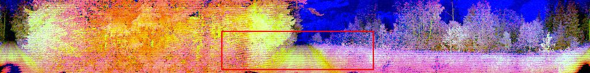

# End-to-End Driving

This repository contains code to train end-to-end model using Rally Estonia dataset. 

Following input modalities are supported:
- Nvidia RGB cameras (only front wide camera used currently)
- Ouster LiDAR range, ambient, intensity image




Following output modalities are supported:
- Steering angle
- Trajectory waypoints (longitudinal part fixed)

Only lateral control (steering) is predicted, longitudinal control (throttle) is not predicted and must be controlled using other means.

## Dataset

Before training a model, dataset needs to be downloaded and prepared . See [_dataloading_](./dataloading/README.md) manual for this. 

## Training

### Environment setup

Environment can set up using conda by following commands:

```bash
# Set up Pytorch environment
conda create -n e2e pytorch torchvision cudatoolkit=11.1 jupyter pandas matplotlib tqdm scikit-learn scikit-image onnx seaborn -c pytorch -c nvidia
conda activate e2e

# Install TensorRT and pycuda
pip install nvidia-tensorrt==7.2.3.4
pip install 'pycuda<2021.1'

# Wandb
pip install wandb

# For visualising predictions
pip install opencv-contrib-python
# need to use specific version of moviepy as newer version did not work
pip install moviepy==1.0.0 
```

### Run training

Model can be trained using following command:

```bash
python train.py --input-modality nvidia-camera --output-modality steering_angle --patience 10 --max-epochs 100 --model-name steering-angle --model-type pilotnet-conditional --wandb-project summer-models-6 --dataset-folder <path to extracted dataset>
```

Use `--input-modality` parameter to train using camera or lidar images.

Use `--output-modality` parameter to use different prediction targets like steering angle or trajectory waypoints.

Use `--model-type` parameter to use different model architectures like `pilotnet-conditional` and `pilotnet-control`.

Use `--wandb-project` parameter to use log using W&B. To use without W&B, just omit this parameter. 

### Visualising results

To visualise trained models, use visualising scripts. Check out [visualising manual](./viz/README.md) for this.  


## Sub projects
- [_velocity_model_](velocity_model/README.md) - logitudinal model using predriven human trajectory