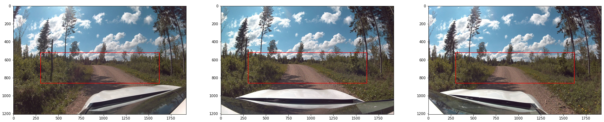
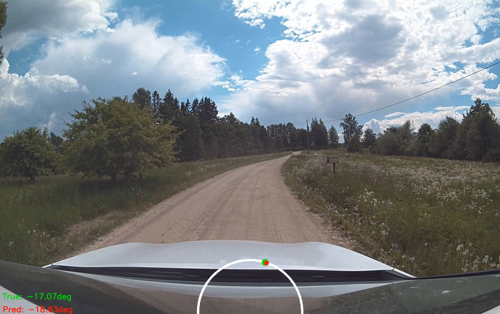

# WP4 End-to-End Driving using Nvidia cameras

This repository contains code to train end-to-end model using Rally Estonia 2020 dataset. Only steering angle
is predicted using front wide camera. Throttle is not predicted and must be controlled using other means.

## Dataset

For information about dataset, check [_data extraction README_](data_extract/README.md).

Notebook `check_crop.ipynb` can be used to adjust the crop. 



## Training

### Environment setup

Environment can set up using conda by following commands:

```bash
# set up pytorch environment
conda create -n lanefollowing pytorch torchvision cudatoolkit=11.1 -c pytorch -c nvidia
conda activate lanefollowing

# install opencv and moviepy for visualising predictions, these are not needed for training
pip install opencv-contrib-python
# need to use specific version of moviepy as newer version did not work
pip install moviepy==1.0.0 
```

Alternative approach is to recreate environment from exported `environment.yml`:
```bash
conda env create -f environment.yml
```

### Run training

*PilotNet* model can be trained by running `train_pilotnet.ipynb` notebook. Make sure to set `root_path` to directory
containing extracted bag files.

There is no bash script to run training, but it should be fairly easy to create from the notebook when the need arises. 

### Visualising results

Notebook `test_tensorrt_model.ipynb` can be used to test trained model:
- compare predicted angles to ground truth angles
- compare performance of TensorRT and PyTorch models.
- create video visualising predicted and ground truth angles



## Models

*models* directory contains pretrained models. All models are trained until validation loss stops to improve for 10 epochs.

*best.pt* is model with the smallest validation loss, *best.onxx* is the same model saved into ONNX format. *last.pt* is model
saved after last training epoch.

- *wide-v1* - middle wide angle camera (A0) trained on only Sulaoja track
- *wide-v2* - middle wide angle camera (A0) trained on all tracks
- *wide-aug-v1* - middle wide angle camera (A0) with heuristic augmentation from side cameras (A1, A2) trained on only Sulaoja track
- *wide-aug-v2* - middle wide angle camera (A0) with Stanley-like augmentation from side cameras (A1, A2) trained on only Sulaoja track
- *wide-aug-v3* - middle wide angle camera (A0) with Stanley-like augmentation from side cameras (A1, A2) trained on all tracks